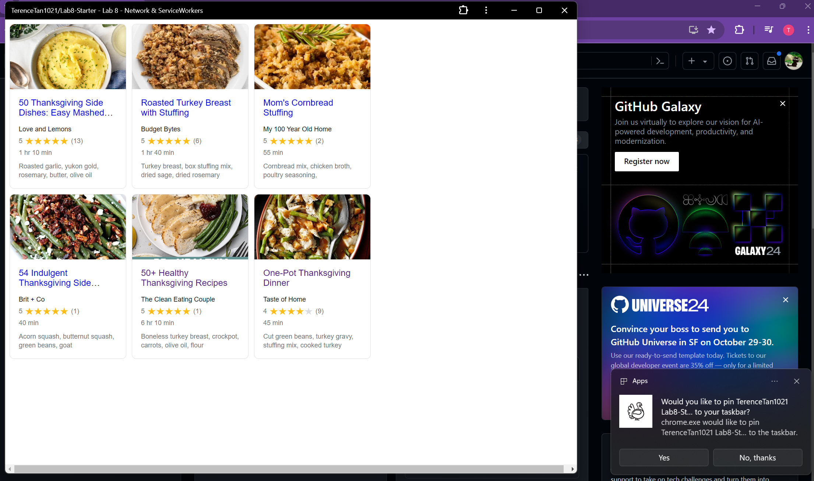
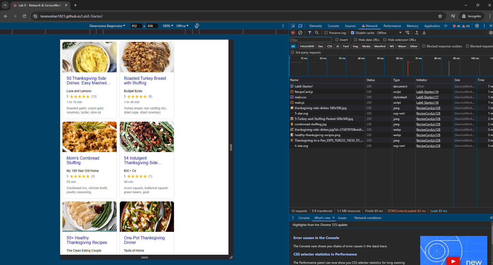

# Lab8-Starter

Graceful degradtion as mentioned in the lab is where you started working down on your code. Service worker is a type of web worker, that can help achiveve graceful degradtion. Service worker allows a website to operated offline or with a slower network speed. Service worker can ensure that your website will up stand its basic function, if the the network becomes slow or even turn off. Which is in terms the same as graceeful degradation.

[link to website](https://terencetan1021.github.io/Lab8-Starter/)

